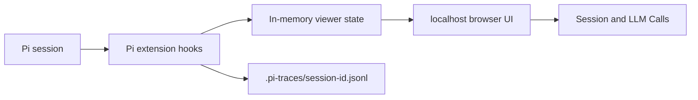

# Pi Trace Viewer

> Live local observability for Pi sessions, branches, compaction, and LLM context.

[中文 README](./README.zh.md)

Pi Trace Viewer answers a practical debugging question: **what did the model actually see?**

It runs as a Pi extension and opens a local browser UI where you can inspect the live session tree, model calls, tool activity, compaction inputs, and provider payloads without modifying Pi's native session files.

## Install

```bash
pi install npm:pi-trace-viewer
```

Start a new Pi session and open the viewer:

```bash
/trace-view
```

The viewer starts at `http://127.0.0.1:7890` by default. If that port is busy, it automatically uses the next available port, such as `7891` or `7892`.

To try the extension for one Pi run without changing your settings:

```bash
pi -e npm:pi-trace-viewer
```

To choose a custom starting port:

```bash
pi --pi-trace-port 8890
```

## What You Can Inspect

- The live Pi session tree, including branches and active turns
- The normalized Pi context passed into `pi-ai`
- The provider-specific payload sent to the backend
- Streaming model output, tool calls, and tool results
- Compaction source messages, cut points, summaries, token metadata, and provider requests
- Custom messages and custom state created by other extensions

## Screenshots

### Realtime Session Viewer


### Session Viewer vs Pi Export

| Pi Trace Viewer | Pi `/export` |
| --- | --- |
|  |  |

### Compaction Context


## Why Use It?

### Live Observation

Pi `/export` is useful after a conversation. Pi Trace Viewer updates while the session is running, so you can watch branches, tool calls, model output, and context changes as they happen.

### Pi Context vs Provider Payload

Every captured LLM call separates two views:

| View | What it shows |
| --- | --- |
| Pi Context | Normalized system prompt, messages, and tools handed to `pi-ai` |
| Provider Payload | Backend-specific request after provider mapping and templates |

Each message can be expanded independently, with rendered Markdown, raw Markdown, and full JSON available when you need them.

### Inspectable Compaction

Compaction events show the messages selected for summarization, split-turn prefixes, cut points, token counts, recent-message policy, previous summaries, extracted file operations, and the provider request used to generate the summary.

That makes context loss after compaction easier to trace.

### Long Sessions Stay Navigable

The session sidebar keeps single-child chains flat and only indents real branches. LLM calls are numbered chronologically and include call kind, turn, model, API, prompt excerpt, tool names, status, request count, and duration.

## How It Works



The extension reads Pi's live snapshot and listens to public lifecycle events, including:

- `context`
- `before_provider_request`
- `after_provider_response`
- `message_update`
- `message_end`
- `session_before_compact`
- `session_compact`
- `session_tree`

## Data and Privacy

Pi Trace Viewer binds only to `127.0.0.1`.

It does not write to Pi's native session JSONL and does not call `appendCustomEntry` or `appendCustomMessageEntry`. Pi's native session remains in:

```text
~/.pi/agent/sessions/<encoded-cwd>/<session-id>.jsonl
```

The extension writes sidecar traces to:

```text
<session-cwd>/.pi-traces/<session-id>.jsonl
```

Trace directories use `0700` permissions and trace files use `0600` permissions. Credential-shaped fields and sensitive response headers are redacted, but prompts, system instructions, tool results, and model output can still contain sensitive data. Treat `.pi-traces` as private local debugging data.

To remove old traces:

```bash
rm -rf "/path/to/session-cwd/.pi-traces"
```

## Local Development

```bash
npm install
npm run check
pi -e /path/to/pi-trace-viewer
```

## Publishing Checklist

Before publishing a new release:

```bash
npm run check
npm pack --dry-run
npm publish --access public
```
