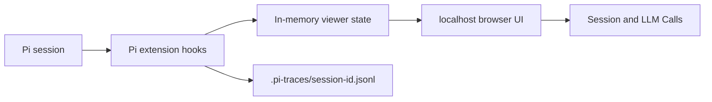

# Pi Trace Viewer

> 面向 Pi 会话、分支、压缩和 LLM Context 的本地实时可观测 UI。

[English README](./README.md)

Pi Trace Viewer 解决一个很具体的问题：**模型到底看到了什么？**

它作为 Pi 扩展运行，并启动一个本地浏览器 UI。你可以在不修改 Pi 原生 session 文件的情况下，实时查看会话树、模型调用、工具活动、压缩输入，以及 provider 实际收到的 payload。

## 安装

```bash
pi install npm:pi-trace-viewer
```

启动新的 Pi 会话后，打开 viewer：

```bash
/trace-view
```

Viewer 默认从 `http://127.0.0.1:7890` 启动。如果端口被占用，会自动递增寻找下一个可用端口，例如 `7891` 或 `7892`。

如果只想在单次 Pi 运行中临时启用，不修改设置：

```bash
pi -e npm:pi-trace-viewer
```

如需指定自定义起始端口：

```bash
pi --pi-trace-port 8890
```

## 可以查看什么

- 实时 Pi 会话树，包括分支和当前 turn
- 传给 `pi-ai` 的规范化 Pi Context
- 实际发送给后端的 provider-specific payload
- 模型流式输出、工具调用和工具结果
- Compaction 的源消息、截断点、summary、token 元数据和 provider 请求
- 其他扩展写入的 custom message 与 custom state

## 截图

### 实时 Session Viewer


### Session Viewer vs Pi Export

| Pi Trace Viewer | Pi `/export` |
| --- | --- |
|  |  |

### Compaction Context


## 为什么使用它？

### 实时观察

Pi `/export` 适合在对话结束后阅读完整历史。Pi Trace Viewer 会在会话运行时持续更新，让你边运行 Pi，边观察分支、工具调用、模型输出和 Context 变化。

### 区分 Pi Context 与 Provider Payload

每一次捕获到的 LLM 调用都会拆成两个视图：

| 视图 | 内容 |
| --- | --- |
| Pi Context | 传给 `pi-ai` 的规范化 system prompt、messages 和 tools |
| Provider Payload | 经过 provider mapping 和 templates 之后，实际发送给后端的请求 |

每条消息都可以独立展开，并支持渲染后的 Markdown、Markdown 原文和完整 JSON。

### 可解释的 Compaction

Compaction 事件会展示被选中用于总结的消息、split-turn prefix、截断点、token 数、最近消息保留策略、上一次 summary、提取到的文件操作信息，以及用于生成 summary 的 provider 请求。

这让“为什么压缩后模型忘了某件事”变成一个可以追溯的问题。

### 长会话也能保持可导航

Session 侧栏会把单子节点链保持扁平，只有真正发生分支时才缩进。LLM calls 按时间编号，并显示调用类型、turn、model、API、prompt 摘要、工具名、状态、请求次数和耗时。

## 工作方式



扩展读取 Pi 提供的 live snapshot，并监听公开生命周期事件，包括：

- `context`
- `before_provider_request`
- `after_provider_response`
- `message_update`
- `message_end`
- `session_before_compact`
- `session_compact`
- `session_tree`

## 数据与隐私

Pi Trace Viewer 只绑定 `127.0.0.1`。

它不会写入 Pi 原生 session JSONL，也不会调用 `appendCustomEntry` 或 `appendCustomMessageEntry`。Pi 原生 session 仍然位于：

```text
~/.pi/agent/sessions/<encoded-cwd>/<session-id>.jsonl
```

扩展会把旁车 trace 写入：

```text
<session-cwd>/.pi-traces/<session-id>.jsonl
```

Trace 目录使用 `0700` 权限，trace 文件使用 `0600` 权限。credential-shaped 字段和敏感响应头会被脱敏，但 prompt、system instruction、工具结果和模型输出仍可能包含敏感信息。请把 `.pi-traces` 当作私有的本地调试数据。

清理旧 trace：

```bash
rm -rf "/path/to/session-cwd/.pi-traces"
```

## 本地开发

```bash
npm install
npm run check
pi -e /path/to/pi-trace-viewer
```

## 发布检查

发布新版本前：

```bash
npm run check
npm pack --dry-run
npm publish --access public
```
